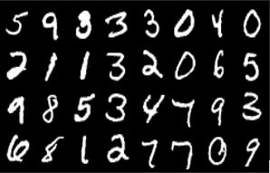
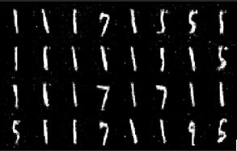
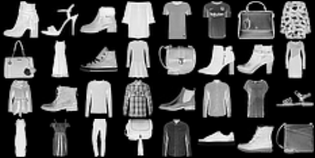
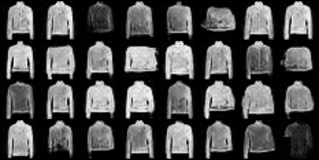
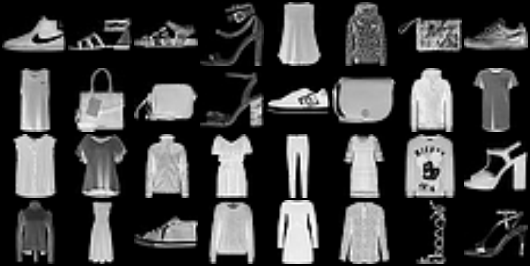
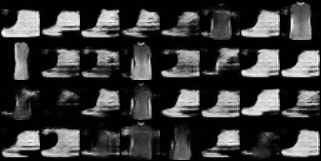
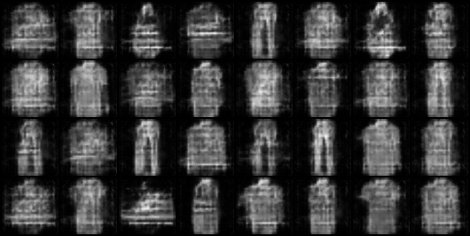
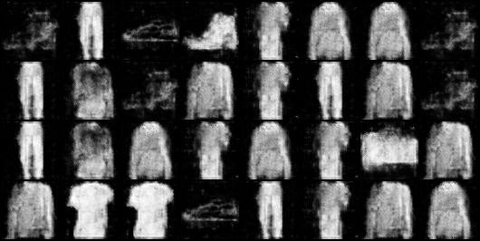

# GANs  
Contains all my GAN-related projects.  

## 1. Simple GAN  
<table>
  <tr>
    <th><h2>MNIST</h2></th>
    <th><h2>Simple GAN</h2></th>
  </tr>
  <tr>
    <td></td>
    <td></td>
  </tr>
</table>
<ul>
  <li>Basic GAN implementation where both the generator and discriminator use simple neural networks.</li>
</ul>

## 2. DCGAN  
<table>
  <tr>
    <th><h2>Fashion MNIST</h2></th>
    <th><h2>DCGAN</h2></th>
  </tr>
  <tr>
    <td></td>
    <td></td>
  </tr>
</table>
<ul>
  <li>A GAN using CNN where the generator upsamples (ConvTranspose2d) and the discriminator downsamples (Conv2d).</li>
  <li>The model is unstable and shows mode collapse, producing the same class repeatedly.</li>
</ul>

## 3. WGAN  
<table>
  <tr>
    <th><h2>Fashion MNIST</h2></th>
    <th><h2>WGAN</h2></th>
  </tr>
  <tr>
    <td></td>
    <td></td>
  </tr>
  <tr>
    <th><h2>WGAN-GP</h2></th>
    <th><h2>Conditional-WGAN-GP</h2></th>
  </tr>
  <tr>
    <td></td>
    <td></td>
  </tr>
</table>

<ul>
  <li>Same as DCGAN, but uses Wasserstein loss instead which stabilizes training</li>
  <li>WGAN-GP use gradient penalty instead of weight cliping to penalize large weights.</li>
  <li>Conditional WGAN-GP guides generation with class labels, reducing mode collapse.</li>
  <li><strong>Note:</strong> Results may look worse than previous models because this was trained for only 25 epochs instead of 100.</li>
</ul>

